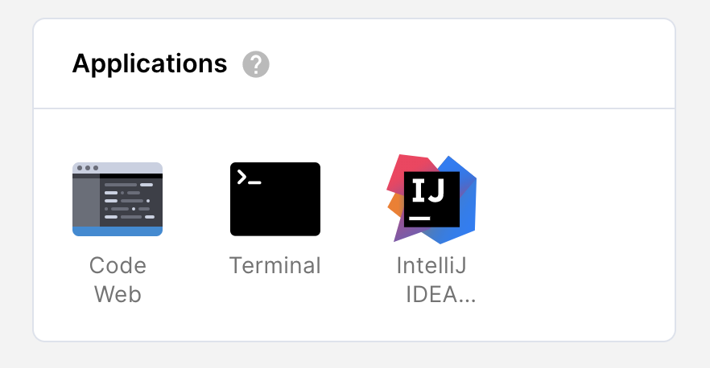

# coder-intellij-template

Java + IntelliJ IDEA in Coder

or use this repo URL in "New workspace from template": `https://github.com/bpmct/coder-intellij-template`

Note: This uses a preview of JetBrains Gateway with a custom application to fetch the URL and launch in Coder. A future version of Coder will include enhanced support.

